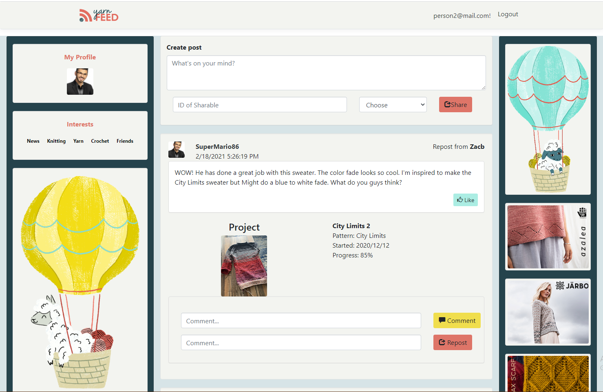

<!--
*** Thanks for checking out the Best-README-Template. If you have a suggestion
*** that would make this better, please fork the repo and create a pull request
*** or simply open an issue with the tag "enhancement".
*** Thanks again! Now go create something AMAZING! :D
-->


<!-- PROJECT SHIELDS -->
<!--
*** I'm using markdown "reference style" links for readability.
*** Reference links are enclosed in brackets [ ] instead of parentheses ( ).
*** See the bottom of this document for the declaration of the reference variables
*** for contributors-url, forks-url, etc. This is an optional, concise syntax you may use.
*** https://www.markdownguide.org/basic-syntax/#reference-style-links
-->

<!-- PROJECT LOGO -->
<br />
<p align="center">
    

  <p align="center">
    A fiber artests new social platform!
    <br />
    <a href="https://github.com/zbiedinger/YarnFeed"><strong>Explore the docs »</strong></a>
    <br />
    <br />
    <a href="">View Demo</a>
  </p>
</p>


<!-- TABLE OF CONTENTS -->
<details open="open">
  <summary>Table of Contents</summary>
  <ol>
    <li>
      <a href="#about-the-project">About The Project</a>
      <ul>
        <li><a href="#built-with">Built With</a></li>
      </ul>
    </li>
    <li><a href="#installation">Installation</a></li>
    <li><a href="#contact">Contact</a></li>
  </ol>
</details>


<!-- ABOUT THE PROJECT -->
## About The Project

<p align="center">
    
</p>

The fiber arts have been my go-to hobby for many years, and it's not easy finding people and sharing that interest these days. There are many great social media platforms available. However, I couldn't find one that checked all the boxes when it came to my knitting and engaging with friends. There is a site that gets close, Ravelry.com, with an extensive library and user base. I wanted to create a news-feed-style web app that tapped into the existing Ravelry library and allows users to share their project progress, new acquisitions, local yarn shops, and patterns they are interested in making. 

Here's why:
* You should be able to share a project with all it's details during it's creation without having to recreate or summerize it into a genaric post. The fiber arts are filled with long term projects and they 
* You should have all your friends and hobbies in one place and not clogged up by other social media.

### Built With

Yarn Feed was built with ASP.Net framework utilizing the Ravelry API to pull user data and create a post. The web page layout and theming were created with Bootstrap.
* [Bootstrap](https://getbootstrap.com)
* [ASP.NET](https://dotnet.microsoft.com/apps/aspnet)
* [Ravelry](https://www.ravelry.com/api)


### Installation

This application reqires a pro Ravelry account and api key to access and update user data. 
1. Create account at [Ravelry](https://www.ravelry.com/invitations)
2. Create an App and get your api keys at [here](https://www.ravelry.com/api)
3. Clone the repo
   ```sh
   git clone https://github.com/zbiedinger/YarnFeed
   ```
4. Enter your API in `APIKeys.cs`
   ```JS
   private static string ClientId = "ENTER YOUR ClientId";
   private static string ClientSecret = "ENTER YOUR ClientSecret";
   private static string Username = "ENTER YOUR Username";
   private static string Password = "ENTER YOUR Password";
   ```

<!-- CONTACT -->
## Contact

Zack Biedinger - [LinkedIn](https://www.linkedin.com/in/zackery-biedinger/) - zbiedinger@mac.com

Project Link: [https://github.com/zbiedinger/YarnFeed](https://github.com/zbiedinger/YarnFeed)
